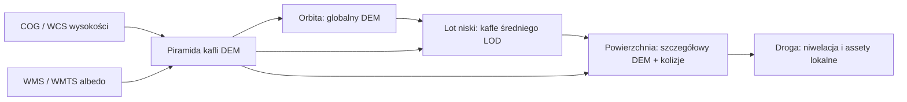

# Globalny teren Księżyca — przekazanie dla Claude’a

## Cel

Gra ma pozwolić przejść płynnie od lotu orbitalnego i swobodnej podróży do chodzenia po powierzchni całego Księżyca. Teren musi być jednym modelem planetarnym, renderowanym w kilku poziomach szczegółowości zależnych od kamery. Lokalny sektor nie może być osobną, płaską sceną odłączoną od globu.

Docelowy przebieg:



## Stan repozytorium 2026-09-09

| Element | Stan | Wniosek |
|---|---|---|
| `godot/assets/moon/height_m.bin` | Globalny raster 1440×720, float32, 0,25°/piksel | Około 5,5–7,5 km/piksel w Tycho; wyłącznie orientacja globalna i zarys dużych struktur. |
| `godot/scripts/moon_globe.gd` | Trzy LOD-y globu 128×64, 256×128, 512×256 | Wizualizacja orbity używa powyższego niskorozdzielczego DEM-u; nie jest to źródło danych dla chodzenia. |
| `godot/scripts/lunar_terrain.gd` | Lokalna siatka 64 m/kafel, gęstość 2 m między wierzchołkami | **2 m to rozstaw geometrii gry, nie rozdzielczość pomiaru.** Bez lepszego DEM-u wysokości są interpolowane/proceduralne. |
| `godot/scripts/lunar_horizon.gd` | Wizualny horyzont Tycho 120 km od stacji | Tymczasowa warstwa z `height_m.bin`; zastąpić globalnymi kaflami LOD. |
| `godot/scripts/terrain_stream.gd` | Klient kafli 35×35, 2 m, cache, asynchroniczny HTTP | Obecnie oczekuje prywatnego gatewaya `/v1/{revision}/{sector}/{x}/{z}.json`, a nie bezpośredniego WCS. |
| `godot/terrain_server.cfg` | `enabled=false`, `127.0.0.1:8787` nie odpowiada | Nie ma działającego GeoServera ani gatewaya. |
| Tycho | Miasto 100 m, Agnes 2 m, lokalny start | Nie istnieje plik lokalnego DEM ani ortofoto Tycho. |

## Dane, które należy zastosować

1. **Globalna baza:** GLD100 WAC DTM. Ma odstęp 100 m, pokrywa 79°S–79°N i nadaje się do stałej siatki całej kuli. Jest dostępny jako GeoTIFF i WMS. Nie jest wystarczający dla chodzenia, ale daje rzetelną formę globalną. [USGS GLD100](https://astrogeology.usgs.gov/search/map/moon_lroc_wac_dtm_gld100_118m)
2. **Średni LOD:** SLDEM2015, 512 px/° (około 59–60 m/piksel), dla ±60°. Pokrywa Tycho i ma wysokości związane z LOLA; pełny GeoTIFF ma około 22 GB. [USGS SLDEM2015](https://www.usgs.gov/media/images/lro-lola-and-kaguya-terrain-camera-dem-merge-60n60s-512ppd)
3. **Bieguny:** globalny/polarny LOLA jako uzupełnienie poza zakresem SLDEM2015. Nie rozciągać danych z ±60° sztucznie na bieguny.
4. **Bliski LOD:** regionalne DEM-y LROC NAC stereo lub SfS, zwykle 1–2 m/piksel, tylko dla faktycznie dostępnych miejsc. Obecnie nie mamy takiego produktu dla Tycho; trzeba go znaleźć w PDS/USGS albo wygenerować z par NAC. [Katalog regionalnych DTM](https://astrogeology.usgs.gov/search/map/regional_topography_and_photometric_cube_data_for_lunar_locations)
5. **Tekstury:** albedo/morfologia to osobna warstwa. WMS/WMTS jest poprawny dla obrazów, ale nie dla kolizji ani siatki wysokości.

### Wynik sprawdzenia: globalny DEM NAC

**Nie znaleziono jednolitego, globalnego DEM-u Księżyca stworzonego z LROC NAC w rozdzielczości 1–2 m/piksel.** NAC wykonuje obrazy o wysokiej rozdzielczości w wąskich pasach; produkty DTM są wydawane jako osobne ROI. PDS regularnie publikuje nowe i poprawione NAC DTM, a przykładowy pakiet topografii NAC z 2023 r. obejmuje tylko sześć regionów o powierzchni około 50–100 km² każdy, z próbkami 0,7–5 m. Nie traktować globalnej mozaiki obrazowej NAC jako globalnego modelu wysokościowego. [PDS: regionalne DTM NAC](https://pds.nasa.gov/ds-view/pds/viewCollection.jsp?identifier=urn%3Anasa%3Apds%3Alunar_lro_lroc_topography_domingue_2023%3Adocument), [PDS RDR: katalog nowych DTM NAC](https://pds.nasa.gov/datasearch/subscription-service/data_product_information.cfm?dsid=LRO-L-LROC-5-RDR-V1.0&releaseid=040C)

### WMS kontra WCS

- **WMS/WMTS:** raster do wyświetlenia — albedo, hillshade, mapa morfologii, ewentualnie kolorowa mapa wysokości.
- **WCS `GetCoverage` albo COG GeoTIFF:** rzeczywiste liczby wysokości, metadane i podzbiory rastra. Tylko tę ścieżkę stosować dla geometrii, kolizji i niwelacji drogi.
- GeoServer `GetCoverage` może zwrócić GeoTIFF i podzbiór coverage; nie pobierać całego globalnego rastra jednym żądaniem. [Dokumentacja WCS](https://docs.geoserver.org/stable/en/user/services/wcs/reference/), [formaty wyjściowe](https://docs.geoserver.org/stable/en/user/services/wcs/outputformats/)

## Docelowa piramida LOD

Wartości są celami renderingu, a nie obietnicą większej rozdzielczości niż dane źródłowe.

| Poziom | Komórka | Zasięg kamery | Dane | Kolizja |
|---|---:|---|---|---|
| L0 | 4–8 km | cała orbita | GLD100/LOLA, silnie zredukowany | nie |
| L1 | 0,5–1 km | tysiące km | GLD100/LOLA | nie |
| L2 | 100–250 m | 50–500 km | GLD100, SLDEM2015 gdzie dostępny | nie |
| L3 | 50–60 m | 5–100 km | SLDEM2015 | opcjonalnie dla lotu niskiego |
| L4 | 8–16 m | 0,5–10 km | downsample regionalnego NAC lub najlepszy dostępny DEM | tylko ograniczony promień |
| L5 | 1–2 m | 0–1 km | NAC stereo/SfS | tak, wokół gracza/pojazdu |

Stosować maksymalny błąd ekranowy (screen-space error), a nie stałe promienie. Kafel przechodzi na dziecko, gdy błąd wysokości po projekcji przekroczy np. 1,5–2 px. Rodzic pozostaje widoczny do czasu załadowania potomków. Wysokości na granicach kafli wymagają halo o szerokości jednej próbki i morphingu lub skirtów.

## Geometria i układ współrzędnych

1. Jedyny datum: promień odniesienia `1737400 m`; długość dodatnia na wschód; współrzędne planetocentryczne. Nie mieszać ziemskich EPSG:4326/Web Mercator z księżycowym CRS bez jawnej transformacji.
2. Globalny renderer powinien używać **cube-sphere/quadtree**, a nie equirectangular grid. Eliminuje to degenerację przy biegunach i daje równomierne kafle.
3. Pozycję gracza, pojazdu i kamerę prowadzić w lokalnym układzie ENU przy aktywnym kaflu. Przy oddaleniu wykonywać floating origin / origin rebasing. Nie przechowywać fizyki postaci w współrzędnych rzędu 1,7 mln metrów.
4. Przejście orbita → powierzchnia jest zmianą układu odniesienia i LOD-u, nie podmianą oddzielnej sceny. W aktualnym prototypie `moon_globe.gd` i `lunar_terrain.gd` są osobne; należy je zastąpić jednym `LunarWorld`.
5. Dla widoku orbitalnego używać fizycznej skali wysokości jako domyślnej. Dopuszczalne jest przełączane wyolbrzymienie pionowe tylko jako tryb diagnostyczny, z wyraźną etykietą.

## Streaming i GeoServer/gateway

### Kontrakt kafla

Gateway powinien zwracać dane gotowe dla Godota, zamiast wymuszać dekodowanie GeoTIFF w kliencie:

```json
{
  "schema": 2,
  "dataset": "sldem2015-v1",
  "tile": "face2/level8/120/77",
  "crs": "moon-enu-or-cubesphere",
  "origin_m": [0, 0, 0],
  "cell_m": 59.2,
  "size": 257,
  "halo": 1,
  "vertical_datum_m": 1737400,
  "height_f32_le_base64": "...",
  "albedo_webp": "...",
  "min_m": -3400,
  "max_m": 1200
}
```

- Godot pobiera najpierw kafle pod rzutem kamery, potem sąsiednie.
- Cache kluczuje: `dataset + revision + face + level + x + y`.
- Gateway pyta WCS `GetCoverage` z BBOX i wymusza rozmiar wynikowego rastra; obrazy pobiera z WMS/WMTS osobno.
- W produkcji preferować wcześniej wygenerowane COG/terrain tiles i CDN. WCS pozostawić do budowy cache lub rzadkich żądań.
- Należy skonfigurować faktyczny origin, warstwy i księżycowy CRS. Obecne `terrain_server.cfg` i `services/geoserver.example.json` są tylko przykładami.

## Autostrady w świecie planetarnym

1. Zachować obecną sieć w `assets/roads/world_routes.json` jako **graf globalny i wektorowe osie tras**. Nie generować stałego mesha drogi dla całego Księżyca.
2. L0–L2: renderować tylko cienki korytarz/krzywą na powierzchni globu.
3. L3: generować uproszczony pas po DEM-ie, bez kolizji, lamp i drobnych barier.
4. L4–L5: wykonać rzeczywistą optymalizację przebiegu na lokalnym DEM-ie, ograniczenie nachylenia, nasypy/wykopy, dwa pasy, zjazdy, łączniki i fizyczną kolizję.
5. Lampy, znaki i segmenty szczelin renderować wyłącznie w promieniu widoczności gracza (np. 1–2 km), jako instancje GPU. Nie tworzyć ich na całej długości globalnych tras.
6. Przebieg nie może skakać na granicy LOD. Wektorowa oś ma być wspólna, a profil wysokości powinien blendować się z nadrzędnym kaflem przed przełączeniem na szczegółowy.

## Plan wykonania dla Claude’a

1. **Inwentaryzacja danych:** zarejestrować GLD100, SLDEM2015, produkty polarne LOLA i ewentualny NAC Tycho; zapisać coverage, datum, zakres, NoData, poziom błędu i licencję.
2. **Usługa danych:** uruchomić GeoServer z COG/ImageMosaic i gateway WCS→tile. Dodać test `GetCapabilities`, `DescribeCoverage`, BBOX Tycho oraz sprawdzenie jednostek wysokości.
3. **`LunarWorld`:** zastąpić oddzielne `moon_globe.gd`, `lunar_horizon.gd` i lokalny streamer jednym cube-sphere quadtree z floating origin.
4. **Najpierw L0–L3:** globalna podróż i zniżanie nad Tycho bez znikania terenu. Zmierzyć czas generacji, pamięć GPU i liczbę żądań.
5. **Potem L4–L5:** dopiero po zdobyciu zweryfikowanego DEM NAC Tycho dodać kolizję, miasto i dokładne drogi.
6. **Autostrady:** przenieść obecny generator do systemu kafli; profil drogi liczyć wyłącznie z dostępnego LOD, ze stałą osią globalną.
7. **Testy akceptacyjne:**
   - z orbity 100 km nad Tycho widoczny jest trójwymiarowy wał;
   - podczas zejścia nie ma dziur ani skoków wysokości;
   - Agnes stoi na fizycznym L5, a miasto 100 m zachowuje relację do jej 2 m wysokości;
   - droga i teren mają ciągłość na granicach kafli;
   - przejazd/lot przez zmianę układu odniesienia nie powoduje utraty precyzji fizyki.

## Czego nie robić

- Nie nazywać geometrii o odstępie 2 m „DEM-em 2 m”, jeśli źródło ma 60 m lub kilka kilometrów na piksel.
- Nie pobierać całego SLDEM2015 do klienta ani nie używać WMS jako danych wysokościowych.
- Nie skalować krateru, miasta ani Agnes po to, aby ukryć brak rozdzielczości danych.
- Nie budować lamp i pełnych meshy autostrady na całej powierzchni Księżyca.
