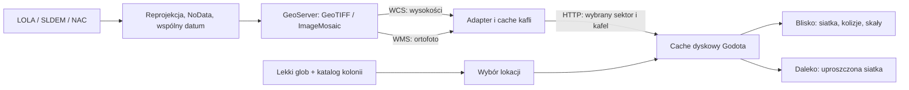

# Model terenu i lokacji

## Wnioski z ZIP-a

`main.py` (v2) jest aktualniejszy od `legacy_main.py`: 14 publicznych lokacji, 21 korytarzy, 12 tur po trzy dni, jeden strategiczny kurs gracza na turę. Silesia jest punktem startu Siwego-04. Kluczowe są połączenia między wyspecjalizowanymi koloniami, stan dróg, piractwo i ograniczona przepustowość transportu.

Starszy plik proponuje ograniczony zakres 3D: **Silesia, Lubin Deep, Shackleton Ice, Crater Zero, Tycho Station, InPost Central**. Zawiera też pomysł drogi Copernicus–Aristarchus, której jakość spada aż do urwania trasy. Nowsza wersja celowo usuwa świątynię Modelu z publicznej mapy. Tajny moduł chłodzenia jest przewożony przez martwą skrzynkę przy Aristarchus Beacon; to wskazówka narracyjna, nie publiczna kolonia.

Poniższy podział jest propozycją implementacji na podstawie obu wersji, nie dodatkowym kanonem wyczytanym z archiwum:

| Obszar | Rola w grze | Dane dla lokalnego sektora |
|---|---|---|
| Silesia | Pierwszy grywalny obszar; przemysł i kurier | DEM południowych wyżyn, lokalne NAC po wyborze miejsca |
| Lubin Deep | Mniejsza lokacja kopalniana | Oddzielny wycinek DEM; wyrobiska i infrastruktura jako modyfikacje gry |
| Shackleton Ice | Woda, paliwo, silny kontrast światła i cienia | Polarny LOLA; ortofoto tylko tam, gdzie istnieje użyteczny obraz |
| Tycho Station | Nauka, medycyna, przekaźnik | Dno Tycho: 43,38°S, 10,63°W; lokalny produkt stereo NAC przed finalnym wyborem działki |
| InPost Central | Duży węzeł, magazyny i kosmodrom | Lokalny DEM pod równikową makietą kompleksu |
| Aristarchus Beacon | Mała placówka, paczkomat, martwa skrzynka | Mały sektor o dobrym pokryciu NAC, wokół niego uproszczony teren |
| Kepler Scrapyard | Złomowisko, piraci, czarny rynek | Mały sektor DEM + autorskie obiekty złomu |
| Crater Zero / świątynia | Ukryta lokacja narracyjna | Oddzielny sektor; identyfikator udostępniany dopiero po odkryciu |

Przystanki serwisowe, uszkodzone odcinki dróg i miejsca przejęcia transportów mogą być kolejnymi małymi sektorami związanymi z korytarzami. Nie trzeba do nich dopisywać pełnej gospodarki kolonii. Nie ma potrzeby modelować w skali 1:1 setek kilometrów pustej trasy już w pierwszym etapie.

## Architektura docelowa

**GeoServer jest źródłem i narzędziem publikacji rastrów.** Godot nie powinien dekodować dużych GeoTIFF-ów ani reprojektować rastrów w klatce gry. Adapter zwraca gotowe małe paczki i może później zostać zastąpiony wypieczonymi plikami w object storage/CDN. Wysokości muszą pochodzić z WCS, a nie ze stylizowanego obrazka WMS.

Pakiet: wersja danych, identyfikator sektora, indeksy x/z, odstęp siatki 2 m, 35×35 próbek float32 little-endian, tekstura PNG 512×512. Rdzeń siatki ma 33×33 wierzchołki, a dodatkowe próbki tworzą halo. Plik JSON używa base64 dla obu danych binarnych. Skala 2 m oznacza siatkę gry, nie gwarantowaną rozdzielczość pomiaru źródłowego.

Aktualny prototyp generuje 25 szczegółowych kafli i 96 uproszczonych. Połączenia HTTP są asynchroniczne, maksymalnie jedno pobranie naraz, z timeoutem 8 s i ograniczeniem odpowiedzi do 4 MiB. Odległe żądania oczekujące są usuwane, nieudane mają 30 s karencji przed następnym zleceniem przy zmianie obszaru. Cache dyskowy ma domyślnie 256 MiB łącznie ze starymi wersjami. Cache adaptera: 512 MiB. Jest to usuwanie najstarszych plików, nie pełne LRU.

Nowo pobrana wysokość pod postacią nie zastępuje natychmiast kolizji. Trafia do cache i jest stosowana po odejściu poza promień dwóch kafli; powrót korzysta już z nowych danych. Przy docelowej grze należy wstępnie pobrać okolice spawnu przed lądowaniem i przygotować blend na granicy obszaru źródłowego. Obecne fartuchy siatek zasłaniają szczeliny LOD, ale nie rozwiązują dużej różnicy wysokości między niespójnymi źródłami.

## Współrzędne

Cały świat: szerokość i długość planetocentryczna, dodatnia długość na wschód, sfera odniesienia o promieniu 1 737 400 m. Każdy sektor ma własny CRS w metrach, geograficzny punkt odniesienia oraz wysokość odniesienia. W Godocie X rośnie na wschód, Z na południe, Y do góry. W rastrze pierwszy wiersz to północ.

Przykładowe definicje w `services/user_projections/epsg.properties` używają **lokalnie przydzielonych**, nie oficjalnych kodów 100001 i 100002. Nie wolno tylko przypisać ich rastrom w innym układzie — dane trzeba poprawnie przeliczyć. Południowe sektory mogą używać księżycowej projekcji polarnej; równikowe i odległe wymagają odpowiednio dobranych projekcji lokalnych. Nie używać ziemskiego EPSG:4326 ani Web Mercator.

Współrzędne kolonii w prototypie są przybliżeniami projektowymi. Oryginalna symulacja v2 podaje regiony, nie dokładne geograficzne punkty kolonii. Kolonie z wpiętym prawdziwym DTM są zamrożone do miejsc, które ten DTM faktycznie pokrywa: Tycho Station `-43.66 / -11.30` (płaskie dno ~4 km na południe od centralnego wzniesienia, wewnątrz `NAC_DTM_TYCHOPK`), Lubin Deep `-87.6 / 34`, Shackleton Ice `-89.6 / 0` (oba w `ldem_87s_5mpp`).

## Wpięte sektory DTM

`tools/bake_sector_dtm.mjs` (Node + geotiff) przelicza źródłowy GeoTIFF na lokalną ramkę styczną kolonii — dokładnie wzorem `lunar_terrain.latlon_at` — i zapisuje `godot/assets/sectors/<slug>/<kx>_<kz>.bin` (siatka 33×33 float32 LE, wiersz = z, wysokości w metrach względem próbki DTM w punkcie kotwicy) plus `sector.json`. Obsługuje projekcję Equirectangular (Tycho, `lon0=348.6`, `lat1=-43.3`) i polarną stereograficzną południową (biegun, `lon0=0`). `lunar_terrain.local_dem_height` czyta te kafle wprost przy każdym `height_at`, więc trasy zapiekają się już na prawdziwym terenie; kafle poza zasięgiem (promień 24, ~1,5 km) wracają do proceduralnego wypełnienia w obwiedni globalnego LOLA 4 ppd.

Wpięte: **Tycho Station** (NAC 2 m/px, relief ±20 m dna z lokalnym wypiętrzeniem do +217 m), **Lubin Deep** (LOLA polar 5 m/px, relief −589…+671 m), **Shackleton Ice** (5 m/px, relief −226…+364 m; ~1% kafli pominiętych z powodu luk NoData w rejonach stale zacienionych — wracają do proceduralnego). Silesia zostaje na autorskim terenie (walidowana referencja węzła/dróg; podmiana to osobne zadanie). Weryfikacja pozycji: `-- --colony="X" --dem-probe` porównane z niezależnym próbkowaniem GeoTIFF-a — zgodność do 0,00 m we wszystkich punktach kontrolnych poza tymi, które przecina profilowanie drogi.

Znane: Shackleton Ice nadal nie domyka obu zjazdów węzła na grunt (`No safe ground landing` w `highway_interchange.gd`) — to geometria wlotów tras, nie teren; osobny problem.

## Kolejność kolejnego etapu

1. Wybrać faktyczny wycinek południowych wyżyn dla Silesii i zweryfikować dostępność DEM/ortofoto.
2. Przeliczyć DEM i ortofoto do jednego księżycowego CRS, sprawdzić jednostki, NoData, orientację i pozycję kilku punktów kontrolnych.
3. Opublikować parę warstw na GeoServerze; wypełnić konfigurację adaptera rzeczywistym origin, wysokością odniesienia, zasięgiem i nazwami warstw.
4. Sprawdzić wycinek w Godocie, szczególnie wspólne krawędzie, kolizje, oświetlenie i zmianę LOD.
5. Dodać Lubin Deep i małą lokację przy trasie, aby sprawdzić zwalnianie całego sektora podczas podróży.

Źródła: [NASA CGI Moon Kit](https://svs.gsfc.nasa.gov/4720/), [GeoServer WCS](https://docs.geoserver.org/stable/en/user/services/wcs/reference/), [własne CRS](https://docs-archive.geoserver.org/stable/en/user/configuration/crshandling/customcrs.html). NASA opisuje globalne SLDEM2015, polarne produkty LOLA oraz lokalne DEM-y stereo NAC; dostępność dla konkretnej lokacji trzeba sprawdzić przed wyborem miejsca.
